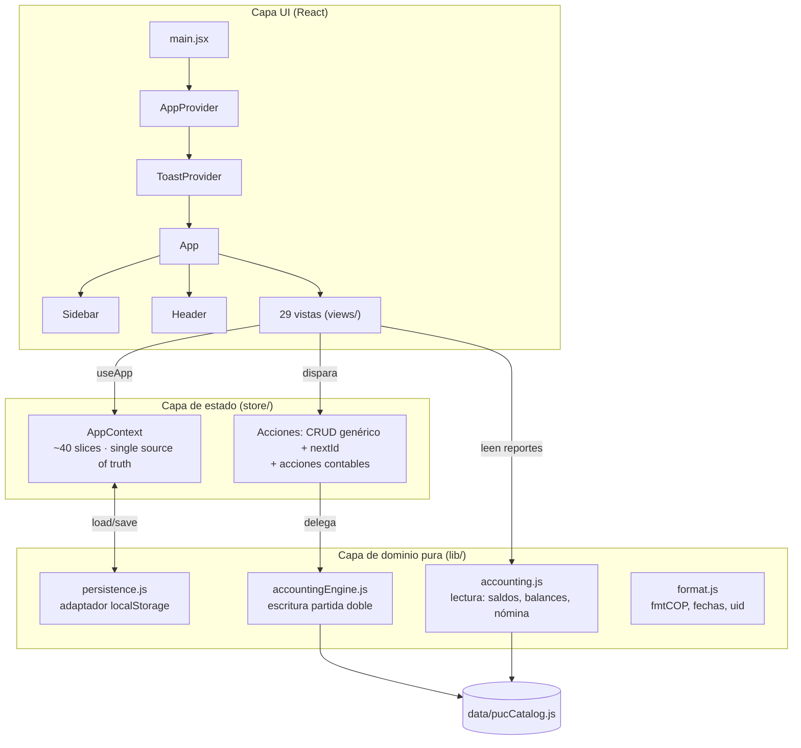
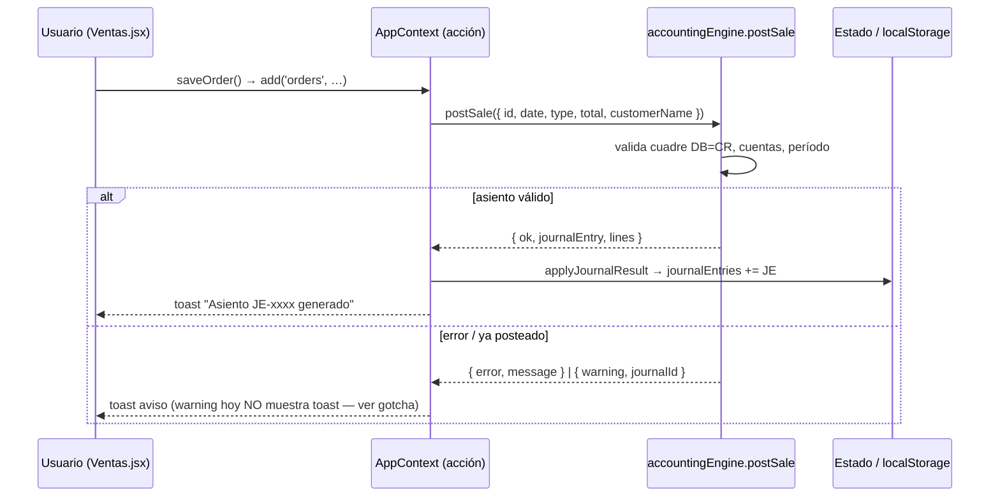
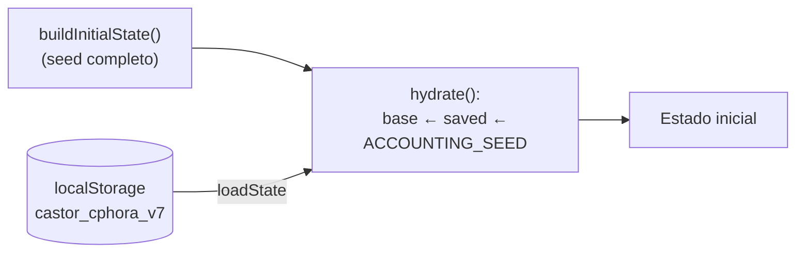

# Arquitectura — CASTOR · Cphora

> Vista de alto nivel del sistema **tal como está hoy** (2026-05-25), no un ideal.
> Las decisiones y sus trade-offs se detallan en [adr/](adr/). La deuda técnica
> conocida está en [PROJECT_CONTEXT.md §15](../PROJECT_CONTEXT.md) y en el
> inventario de auditoría.

## 1. Contexto y objetivo

ERP/CRM + Contabilidad para una fábrica de muebles premium colombiana. Hoy es una
**SPA cliente-solo**: todo el estado vive en el navegador y se persiste en
`localStorage`. No hay backend, API, autenticación ni multiusuario
(ver [ADR-001](adr/ADR-001-persistencia-solo-cliente.md)).

## 2. Diseño de alto nivel

Tres capas conceptuales, de afuera hacia adentro:



**Principio rector:** la lógica contable es **pura** (sin React, sin I/O, sin
DOM) y testeable de forma aislada — es lo mejor diseñado del sistema. La fragilidad
está *alrededor* (persistencia y cableado), no en el cálculo. Ver
[src/lib/README.md](../src/lib/README.md).

### Árbol de providers (`src/main.jsx`)

```
<StrictMode>
  <AppProvider>      → estado global + acciones + hidratación
    <ToastProvider>  → notificaciones toast
      <App />        → layout + enrutado por estado (view = string)
```

## 3. Módulos y responsabilidades

| Módulo | Archivo(s) | Responsabilidad | ADR / notas |
|--------|-----------|-----------------|-------------|
| **Estado global** | `store/AppContext.jsx` | *Single source of truth*; CRUD genérico; hidratación seed↔persistido; expone acciones contables | [ADR-002](adr/ADR-002-estado-global-context-unico.md), [ADR-003](adr/ADR-003-slices-contables-reseed.md) |
| **Motor contable (escritura)** | `lib/accountingEngine.js` | Partida doble: valida, balancea, asigna IDs y arma asientos; hooks de dominio (`postSale`, `postPayroll`…) | Ver gotchas en [lib/README](../src/lib/README.md) |
| **Reportes (lectura)** | `lib/accounting.js` | Saldos por cuenta/clase, balance de prueba, ecuación contable, KPIs, preview de nómina | [ADR-009](adr/ADR-009-balances-derivados-on-read.md) |
| **Persistencia** | `lib/persistence.js` | Adaptador `localStorage` (clave versionada `castor_cphora_v7`) | [ADR-001](adr/ADR-001-persistencia-solo-cliente.md), [ADR-008](adr/ADR-008-migracion-por-storage-key.md) |
| **Catálogo PUC** | `data/pucCatalog.js` | 91 cuentas (clases 1–7), naturaleza, nivel jerárquico | — |
| **Seeds** | `data/seed.js`, `data/erpSeed.js` | Estado inicial: asientos, bancos, ERP (~90 registros) | — |
| **UI compartida** | `components/` | Tablas, filtros, modales, formularios, gráficos, iconos | — |
| **Vistas** | `views/` (29) | 17 ERP + 12 contabilidad | — |
| **Navegación** | `nav.js`, `App.jsx` | Menú, breadcrumbs y mapa `view → componente` | [ADR-005](adr/ADR-005-sin-router.md) |

## 4. Flujos críticos

### 4.1 Venta → asiento contable (único flujo de escritura contable en vivo hoy)



El cobro (`postCustomerCollection`) sigue el mismo patrón: Banco DR / CxR CR.
Los asientos aparecen en Libro Diario/Mayor en tiempo real.

> ⚠️ **Solo `postSale`, `postCustomerCollection` y `postManualEntry` están
> cableados a la UI.** `postSupplyPurchase`, `postSupplierPayment`, `postPayroll`
> y `reverseJournalEntry` existen y están probados vía seed, pero **ningún botón
> los dispara** todavía → riesgo de divergencia ERP↔contabilidad.

### 4.2 Hidratación del estado (al cargar la app)



> ⚠️ **Gotcha de hidratación ([ADR-003](adr/ADR-003-slices-contables-reseed.md)):**
> `ACCOUNTING_SEED()` se aplica **al final**, pisando lo persistido para
> `journalEntries`, `journalLines`, `costCenters` y `fiscalPeriods`. Consecuencia:
> los asientos posteados en vivo y las ediciones de centros de costo **no
> sobreviven a un refresh**. Fix pendiente (roadmap).

### 4.3 Flujo de negocio ERP (referencia)

```
Lead → Cotización → Pedido (Ventas) ──postSale──► Asiento de venta
                       │
   Auditoría: verificar → Crear OP → Producción (kanban) →
   Inventario Terminado → Despacho
                       │
   Pago (Ventas) ──postCustomerCollection──► Asiento de cobro → Postventa · Garantías
```

## 5. Decisiones arquitectónicas (índice de ADRs)

| ADR | Decisión | Estado |
|-----|----------|--------|
| [001](adr/ADR-001-persistencia-solo-cliente.md) | Persistencia solo en cliente (localStorage) | Accepted (de facto) |
| [002](adr/ADR-002-estado-global-context-unico.md) | Estado global único en un Context síncrono | Accepted (de facto) |
| [003](adr/ADR-003-slices-contables-reseed.md) | Slices contables re-sembrados desde código ⚠️ | Accepted (de facto) — fix pendiente |
| [004](adr/ADR-004-sin-typescript.md) | Sin TypeScript | Proposed |
| [005](adr/ADR-005-sin-router.md) | Navegación sin router | Proposed |
| [006](adr/ADR-006-sin-rbac.md) | Sin control de acceso por roles | Proposed |
| [007](adr/ADR-007-dinero-como-float.md) | Dinero como `float` con tolerancia de cuadre | Proposed |
| [008](adr/ADR-008-migracion-por-storage-key.md) | Migración por bump de `STORAGE_KEY` | Proposed |
| [009](adr/ADR-009-balances-derivados-on-read.md) | Balances derivados on-read | Proposed |

## 6. Puntos de integración (futuros, no implementados)

- **Backend**: el adaptador de persistencia está pensado para cambiarse a
  Firebase/Supabase, pero su interfaz es **síncrona** y el backend será
  **asíncrono** — la migración no será un swap trivial (ver
  [ADR-001](adr/ADR-001-persistencia-solo-cliente.md)).
- **Hubs contables colombianos** (Siigo / WorldOffice / Helisa) y exportación
  (CSV/Excel/PDF real): pendientes; hoy las "exportaciones" son stubs `.txt`.
- **Autenticación y roles**: `currentUser.role` existe pero no controla acceso
  (ver [ADR-006](adr/ADR-006-sin-rbac.md)).
