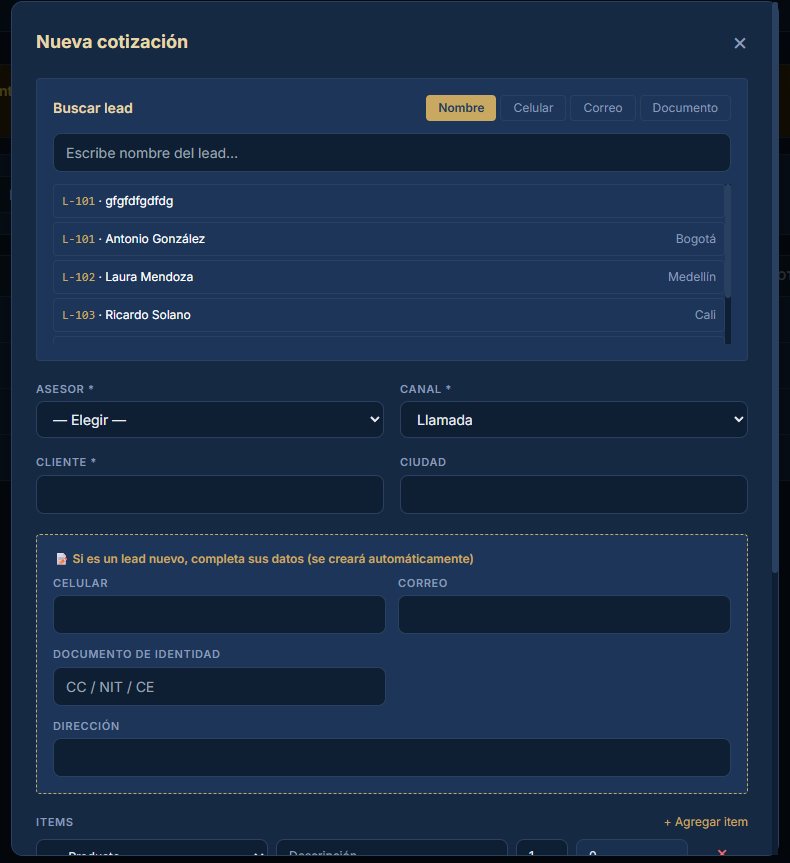

# INVENTARIO_GLOBAL.md — Hallazgos de verificación humana

Verificación humana lado a lado de castor-mvp (React) vs Castor_Dashboard_Demo6.html.
Detecta divergencias fuera del alcance del Bloque 1 que el protocolo de 
auto-verificación técnica no captura: vistas faltantes, funcionalidades 
inexistentes, validaciones rotas, problemas de UX globales, y comparación 
contra los videos del cliente.

Fecha: 2026-05-25 (lunes noche)
Audiencia esperada de próxima demo: dueño + gerencia + posible contador
Tiempo disponible: martes a viernes

## Clasificación de severidad

- **P0 — Crítico para demo:** sin esto el cliente reclama explícitamente. 
  Arreglar antes del martes/miércoles.
- **P1 — Alto impacto visible:** el cliente lo va a ver y mencionar. 
  Arreglar miércoles/jueves.
- **P2 — Funcional pero invisible al cliente:** bugs que tardarán en aparecer. 
  Arreglar si hay tiempo viernes.
- **P3 — Cosmético menor:** diferencias mínimas. Postergar.

---

## MÓDULO: INICIO (Dashboard)

### H-001 — Botón "Nuevo" del header con menos opciones que Demo6 · P0

**Ubicación:** Header superior derecho, todas las páginas.

**Estado en Demo6:** botón "Nuevo" despliega menú con Crear nuevo
×
👤 Lead
📄 Cotización
💰 Pago
🛡 Garantía
📦 Nuevo producto
✓ Terminado
🧑 Empleado
🏦 Cuenta bancaria
📞 Postventa.

**Estado en React:** menú con menos opciones que Demo6.

**Impacto:** el cliente usa este botón como acceso rápido global. Tener menos 
opciones lo obliga a navegar al módulo correspondiente, rompe la fluidez 
demostrada en los videos.

**Acción esperada:** alinear el menú del botón "Nuevo" con todas las opciones 
del Demo6, en el mismo orden.

---

### H-002 — Tarjeta "Inventario terminado" del Inicio: faltan bodegas · P0

**Ubicación:** Dashboard de Inicio, sección "Inventario terminado · Ver →".

**Estado en Demo6:**
18 unidades listas
CEDI         13
Castor 43     2
Castor Ctg    1
Volcanes      2
Insumos 1     0
Insumos 2     0
(Muestra 6 bodegas, incluye las de materia prima aunque estén en 0)

**Estado en React:**
18 unidades listas
CEDI         13
Castor 43     2
Castor Ctg    1
Volcanes      2

(Solo muestra 4 bodegas, faltan Insumos 1 e Insumos 2)

**Impacto:** desinformación crítica. El cliente espera ver TODAS las bodegas 
(según requerimientos §7.5 son 6 bodegas con tipo PT/MP). Mostrar solo 4 
oculta la existencia de bodegas de MP.

**Acción esperada:** agregar Insumos 1 e Insumos 2 a la tarjeta, aunque su 
valor sea 0. Mantener el mismo orden de Demo6.

---

## MÓDULO: LEADS

### H-003 — Modal "Nuevo lead" con menos opciones que Demo6 · P0

**Ubicación:** Leads → botón "+ Nuevo lead" → modal de creación.

**Estado en Demo6:** modal completo con TODOS estos campos:
- Tipo * (Lead | Lead institucional) — toggle/radio
- Nombre *
- Documento (CC / NIT / CE)
- Teléfono *
- Email
- Ciudad
- Dirección
- Canal * (default: Llamada)
- Clasificación * (default: alto)
- Estado * (default: Nuevo)
- Asesor * (— Elegir —)
- Productos de interés (con botón "+ Agregar producto")
- Valor estimado (COP) auto (default: 0)

**Estado en Demo6 — variante "Lead institucional":** mismo modal + campos extra:
- Razón Social
- NIT
- Contacto

**Estado en React:** modal con menos campos que Demo6 (pocos tipos de filtros 
también, según la queja del usuario).

**Impacto:** crítico. El cliente no puede crear leads completos como en Demo6. 
La variante institucional no existe o está incompleta.

**Acción esperada:** reconstruir el modal completo con TODOS los campos del 
Demo6, incluyendo el toggle Lead/Lead institucional y los campos condicionales.

---

### H-004 — Validaciones de formulario de Lead rotas · P0

**Ubicación:** modal "Nuevo lead" y "Editar lead".

**Estado actual React:** permite guardar lead con:
- Teléfono que contiene letras (debería validar solo números)
- Sin dirección
- Sin producto de interés
- Sin valor estimado COP

**Estado esperado (según Demo6):** validar campos obligatorios y formato 
(teléfono solo dígitos).

**Impacto:** crítico. Permite registrar datos basura que rompen otros 
módulos y reportes.

**Acción esperada:** implementar validaciones de:
- Teléfono: solo dígitos, mínimo 7 caracteres
- Campos marcados con * son obligatorios
- Bloquear submit hasta que todos los obligatorios estén llenos y bien formados
- Mensajes inline de error en cada campo inválido

**Inspección necesaria:** Claude debe leer el saveLead() de Demo6 para 
replicar EXACTAMENTE las validaciones que ese tiene y si no las ve, igual por logica aplicar las necesarias.

---

### H-005 — Lista de leads anteriores no se muestra ni autorrellena · P1

**Ubicación:** al crear/editar leads.

**Estado esperado:** el modal debería mostrar listado de leads anteriores y 
permitir autorrellenar para no tener que escribir manualmente cada vez 
(salvo que sea totalmente nuevo).

**Estado actual React:** no muestra leads anteriores, fuerza a escribir todo 
a mano siempre.

**Impacto:** UX muy frustrante para el usuario que crea leads frecuentemente.

**Acción esperada:** implementar autocompletado/sugerencias de leads previos 
mientras se escribe. Verificar contra Demo6 si tiene este comportamiento o 
si es mejora UX.

**Nota:** si Demo6 NO tiene esto, mover a MEJORAS_PROPUESTAS.md (no es 
divergencia, es nueva funcionalidad).

---

### H-006 — Ficha de lead: falta dato "GrupoInmob SA" debajo del nombre · P2

**Ubicación:** Leads → click en lead → panel derecho con ficha.

**Estado en Demo6:** debajo del nombre "Antonio González" muestra dato 
adicional "GrupoInmob SA" (probablemente razón social del lead institucional 
o empresa asociada).

**Estado en React:** solo muestra el nombre, sin el dato adicional.

**Acción esperada:** mostrar el dato secundario (razón social / empresa) 
debajo del nombre principal, mismo formato visual.

---

### H-007 — Ficha de lead: layout de datos de contacto · P3 (NO corregir, dejar React)

**Ubicación:** Leads → click en lead → panel derecho.

**Estado en Demo6:** datos de contacto (teléfono, email, NIT, etc.) en un 
formato.

**Estado en React:** mejor división visual de datos según opinión del usuario.

**Decisión:** MANTENER el diseño actual de React porque es mejor que Demo6 
según evaluación del usuario. Anotar en MEJORAS_PROPUESTAS.md como mejora 
intencional, no como divergencia a corregir.

---

### H-008 — Botón "Contactar nuevamente": desfase visual del ícono · P2

**Ubicación:** Leads → ficha de lead → botón "Contactar nuevamente".

**Estado:** desfase visual, el ícono (campana) no queda lineal con el texto.

**Acción esperada (dos opciones, Claude decide cuál es menos invasiva):**
- (a) Cambiar el ícono por una campana más pequeña
- (b) Aumentar el espacio interno del botón para que no se vea el desfase

**Verificación:** inspeccionar el botón equivalente en Demo6 y replicar exacto.

---

### H-009 — Historial de notas: orden cronológico invertido · P1

**Ubicación:** Leads → ficha de lead → sección "Notas" o "Seguimientos".

**Estado en Demo6:** al agregar una nota nueva, esta queda al INICIO de la 
lista (formato pila, último en entrar primero en mostrarse). Más estético 
y usable.

**Estado en React:** la última nota agregada queda al final de la lista.

**Acción esperada:** invertir el orden de renderizado para que las notas 
nuevas aparezcan arriba (DESC por fecha de creación).

---

### H-010 — "+ Nueva cotización" desde Lead no abre modal sino que navega · P0

**Ubicación:** Leads → ficha de lead → botón "+ Nueva cotización".

**Estado en Demo6:** clic en el botón abre directamente el modal de nueva 
cotización con el lead preseleccionado, SIN cambiar de módulo.

**Estado en React:** clic en el botón navega al módulo de Cotizaciones Y 
abre el form (que además está mal hecho, ver H-011).

**Impacto:** crítico. El cliente espera quedarse en el contexto del lead. 
Cambiar de módulo rompe el flujo demostrado en el video.

**Acción esperada:** abrir el modal de cotización SIN navegar fuera de Leads. 
Conservar el contexto del lead. Al cerrar el modal, volver al perfil del lead.

**Nota:** Claude declaró este punto como ✅ en su verificación del Bloque 1 
porque el modal "técnicamente abre". La realidad observada por el usuario es 
que el cambio de módulo intermedio rompe la experiencia. Reclasificar como ❌ 
en la tabla del Bloque 1.

---

## MÓDULO: COTIZACIONES

### H-011 — Form de cotización deficiente (problema declarado por usuario) · P0

**Ubicación:** Cotizaciones → form de nueva cotización (al que se llega desde Lead).

**Estado:** el usuario declara que el form está "mal hecho" sin especificar 
qué exactamente.

**Acción esperada:** revisar TODAS las diferencias del form de cotización React 
vs Demo6 y corregirlas. Incluye:
- Buscador de lead con toggles (ya implementado en Bloque 1, validar)
- Autollenado al seleccionar lead
- Arrastre de productos de interés
- Todos los campos del Demo6 en mismo orden y formato

**Nota:** este hallazgo se solapa con el Bloque 1 ya verificado. Claude debe 
comparar la queja del usuario con lo que ya está hecho para identificar qué 
falta o qué quedó mal.

---

### H-012 — Filtros de búsqueda de Cotizaciones: falta "Asesor" · P1

**Ubicación:** Cotizaciones → barra de filtros superior.

**Estado en Demo6:** incluye filtro por Asesor.

**Estado en React:** falta el filtro por Asesor.

**Acción esperada:** agregar dropdown de Asesor en los filtros, con la misma 
lista de LEAD_ASESORES usada en el resto de la app.

---

### H-013 — Falta menú de descuentos rápidos en form de cotización · P1

**Ubicación:** modal "Nueva cotización" → campo Descuento %.

**Estado actual React:** input numérico libre.

**Estado esperado:** menú/dropdown con opciones predefinidas:
- 5%
- 10%
- 15%
- 20%
- Etc.
- Opción "Nuevo descuento" para valor personalizado

**Acción esperada:** convertir el input de descuento en un select con valores 
predefinidos + opción de descuento custom.

**Verificación:** confirmar con Claude si Demo6 tiene este menú o si es 
mejora UX nueva. Si NO está en Demo6, mover a MEJORAS_PROPUESTAS.md.

---

### H-014 — Falta opción "Quitar lead" que limpie el form · P1

**Ubicación:** modal "Nueva cotización" → tarjeta de lead seleccionado.

**Estado esperado:** botón "Quitar" debe:
- Quitar el lead seleccionado
- Limpiar TODA la información autorrellenada del form (cliente, ciudad, 
  canal, asesor, productos de interés arrastrados)
- Dejar el form en estado inicial

**Estado actual React:** existe botón "Quitar" pero el comportamiento de 
limpieza completa no está confirmado.

**Verificación necesaria:** Claude debe probar el botón "Quitar" actual y 
confirmar si limpia todo o solo el lead.

---

### H-015 — Falta botón "PDF" para descargar cotización con formato del cliente · P0

**Ubicación:** Cotizaciones → tabla principal Y detalle de cotización.

**Estado esperado:** botón "PDF" al lado de cada cotización en la tabla, 
o como apartado extra en la fila, que descargue la cotización con formato 
EXACTO al PDF de referencia (Cotizacion_COT-2001_Laura_Mendoza.pdf 
adjuntado por el usuario).

**Formato del PDF esperado:**
- Header con logo CASTOR + "MUEBLES Y ACCESORIOS"
- Datos del cliente (CLIENTE, NIT/CC, EMAIL, NO. CONTACTO, DIRECCION, CIUDAD)
- FECHA y METODO DE PAGO
- Tabla de items con columnas: IMAGEN, PRODUCTO, DESCRIPCION, QTY, PRECIO, 
  VALOR TOTAL
- Notas: vigencia (ej: "Esta cotizacion es valida por 45 días"), inclusión 
  de IVA, tiempos de producción, condiciones de anticipo
- Resumen: SUBTOTAL, ABONO, FLETE, TOTAL
- Footer: NOMBRE DEL ASESOR, EMAIL, CELULAR + datos de empresa (web, 
  redes sociales, direcciones)

**Impacto:** crítico. El cliente espera poder descargar cotizaciones como 
PDF profesional para enviar al cliente final. Sin esto el módulo de 
cotizaciones es incompleto.

**Acción esperada:** implementar generación de PDF con jsPDF o react-pdf, 
replicando el formato del PDF adjuntado lo más fielmente posible.

**Plus declarado por usuario:** el cliente reconoce que React tiene mejores 
opciones que Demo6 en este módulo (estado, creación, vigencia visibles 
directamente en la tabla) — eso se mantiene.

---

## MEJORAS DECLARADAS POR USUARIO (mover a MEJORAS_PROPUESTAS.md)

### MEJORA-001 — Layout de datos de contacto en ficha de lead

React tiene mejor división visual que Demo6 según evaluación del usuario. 
Mantener React, no replicar Demo6.

### MEJORA-002 — Tabla de Cotizaciones con campos extra

React muestra estado, fecha de creación y vigencia directamente en la tabla. 
Es mejora sobre Demo6 según evaluación del usuario. Mantener.

---

## RESUMEN POR PRIORIDAD

### P0 — Crítico (arreglar martes/miércoles)
- H-001: Botón "Nuevo" del header con menos opciones
- H-002: Tarjeta "Inventario terminado" Inicio: faltan Insumos 1 e Insumos 2
- H-003: Modal "Nuevo lead" incompleto (faltan campos + variante institucional)
- H-004: Validaciones de Lead rotas (acepta basura)
- H-010: "+ Nueva cotización" desde Lead navega en vez de abrir modal en contexto
- H-011: Form de cotización deficiente (revisar Bloque 1)
- H-015: Falta botón PDF de cotización con formato

### P1 — Alto impacto (arreglar miércoles/jueves)
- H-005: Sin autocompletado de leads anteriores
- H-009: Orden cronológico de notas invertido
- H-012: Falta filtro Asesor en Cotizaciones
- H-013: Falta menú de descuentos rápidos
- H-014: "Quitar lead" no limpia el form completo

### P2 — Funcional invisible (si hay tiempo viernes)
- H-006: Falta dato secundario debajo del nombre en ficha de lead
- H-008: Desfase visual del ícono "Contactar nuevamente"

### P3 — Cosmético (postergar)
- (Ninguno declarado en este inventario; H-007 ya decidido mantener React)

---

## NOTA PARA CLAUDE

Este inventario es PARCIAL — solo cubre Inicio, Leads y Cotizaciones. Los 
módulos restantes (Clientes, Pedidos, OPs, Productos, Almacén, Materia Prima, 
Innovación, Producción, Auditoría, Inventario Terminado, Despacho, Tesorería, 
Contabilidad, etc.) NO han sido inventariados aún por el usuario humano.

Procedé así:
1. Inspeccioná el Demo6 para los puntos donde este documento dice 
   "[Claude debe inspeccionar]" o "verificar contra Demo6".
2. Aplicá las correcciones P0 primero, en el orden listado.
3. Después de cada P0, generá un mini-reporte de verificación 
   (no el protocolo completo de 7 pasos, solo: qué cambiaste + screenshot 
   antes/después + 3-5 puntos de validación).
4. NO arranques P1 hasta que yo apruebe los P0.
5. Si encontrás durante la corrección que algún hallazgo está mal 
   clasificado o mal descrito, decímelo antes de cambiar nada por tu cuenta.

Tiempo objetivo: P0 completos miércoles fin de día. P1 jueves-viernes.